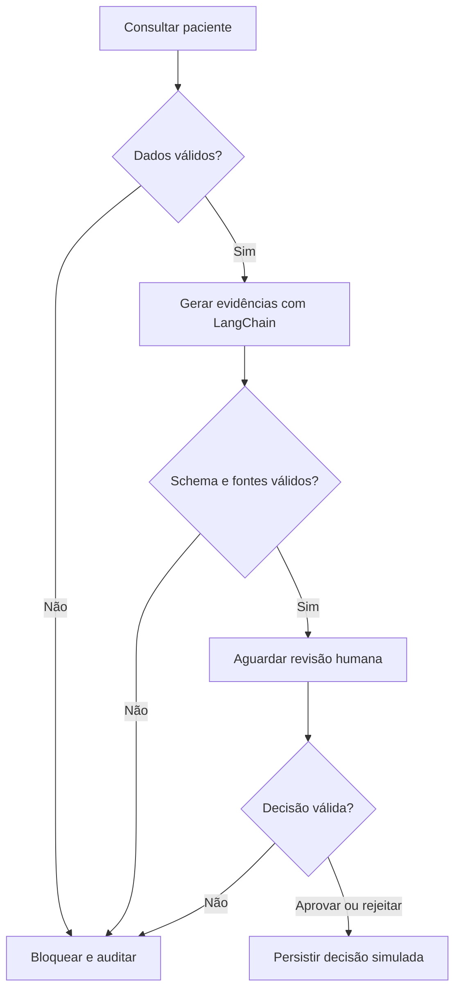

# Tech Challenge Fase 3 — Assistente de apoio à revisão de casos de mama

**Versão 0.1.0: base inicial, NÃO é a entrega final.**

Projeto individual de Gabriel Augusto Russo, com continuidade temática das fases 1 e 2.
O objetivo final é integrar uma LLM ajustada com dados curados a um assistente contextualizado
com LangChain e LangGraph. Esta versão prepara a infraestrutura e a verificação.

## Estado honesto da implementação

- Código: consultas SQLite parametrizadas, fontes versionadas, pipeline LangChain,
  grafo com revisão humana, CLI e integração configurável com Ollama.
- Modo `fixture`: geração determinística para testes, **sem LLM**.
- Modo `ollama`: chamada real configurada no código; **não comprova fine-tuning**.
- O runtime inicial extrai evidências e prepara revisão administrativa. Ainda não responde
  livremente a perguntas clínicas nem sugere tratamentos. Toda pergunta válida usa esse
  fluxo estreito nesta versão, inclusive perguntas fora do escopo.
- Dataset seed e curadoria inicial existem; **não há treinamento, adaptador nem métricas de LLM**.
- Testes de SQLite e curadoria executados neste ambiente. Instalação das dependências de
  LangGraph/pytest foi interrompida por autorização de rede; grafo, Ollama, Docker e CI
  ainda não foram executados. Veja [verificação](docs/VERIFICATION.md).

## Estrutura

| Caminho | Responsabilidade |
|---|---|
| src/tc3/storage.py | Pacientes, auditoria e decisões no SQLite |
| src/tc3/generation.py | LangChain, fixture, Ollama e validação de evidências |
| src/tc3/workflow.py | Grafo e interrupção para revisão humana |
| src/tc3/cli.py | Demonstração por terminal |
| src/tc3/dataset.py | Curadoria, exportação JSONL e análise exploratória |
| data/ | Pacientes, protocolos fictícios e seed de FAQ |
| tests/ | Testes de unidade e integração |
| .github/workflows/ci.yml | Testes e empacotamento em três sistemas operacionais |
| docs/ | Aceite, dados, avaliação e evidências de verificação |

## Instalação prevista para ambiente com internet

Execute a partir da raiz extraída do projeto. Alvos: Python 3.11 ou 3.12 em macOS,
Linux ou Windows. Compatibilidade ainda será confirmada pelo CI; não há mínimo de
memória de inferência validado. A fixture não precisa de GPU nem de Ollama.

```bash
python3 -m venv .venv
source .venv/bin/activate
python -m pip install -r requirements-dev.txt
python -m pip install -e . --no-deps
python -m pip check
python -m pytest -v
```

Windows PowerShell: use `py -3.12 -m venv .venv` e
`.venv\Scripts\Activate.ps1`, depois os comandos `python -m ...` acima.
Os pins diretos estão definidos; um lock completo será gerado após validar a resolução.

## Demonstração sem modelo

```bash
tc3 --mode fixture --patient SYN-001
```

O terminal mostra as fontes e as pendências e aguarda `s` para aprovar ou `n` para rejeitar.
Nenhuma decisão é automática. Enter encerra sem decidir. O checkpoint é **em memória**:
não é possível retomar em outro processo nesta versão. Auditoria e decisões permanecem no
SQLite `runtime/demo.sqlite`. A aprovação não envia mensagens, solicita exames ou prescreve.
O nome do revisor é apenas um rótulo de demonstração, não autenticação de um profissional.

Outros casos: `--patient SYN-002` (registro disponível), `--patient SYN-003` (incompleto),
`--patient missing` (bloqueio, saída 2). Use `--db runtime/outro.sqlite` para uma base nova.
O seed é idempotente e não sobrescreve pacientes existentes.

## Execução com Ollama — depende de serviço/modelo local

```bash
tc3 --mode ollama --model NOME_DO_MODELO_INSTALADO --patient SYN-001
```

Substitua o nome pelo exibido em `ollama list`. Nenhum modelo é baixado automaticamente.
É possível usar `OLLAMA_MODEL` e `OLLAMA_BASE_URL`; `.env.example` documenta as variáveis,
mas não é carregado automaticamente. O modelo ajustado e sua distribuição serão definidos
após o piloto no Mac M4 24 GB. Ollama é uma opção de inferência; o backend definitivo pode
mudar conforme o formato do adaptador. Não há caminho de exportação já validado.

Saída inválida, fonte inventada ou falha do modelo bloqueiam o fluxo; não há fallback
disfarçado de resposta da LLM. A seleção de citações exatas é conservadora e pode causar
muitos bloqueios com modelos pequenos. Isso será medido, não escondido.

## Dados e análise exploratória

Após a instalação:

```bash
python -m tc3.dataset
```

Gera `runtime/dataset/{train,validation,test}.jsonl` e `analysis.json`.
Os 12 FAQs são seed de formato, não dataset suficiente de fine-tuning. Leia o
[data card](docs/DATA_CARD.md) antes de ampliar ou treinar.

Sem instalar nada, é possível executar os módulos de dados e os testes básicos:

```bash
PYTHONPATH=src python -m unittest discover -s tests -p test_core.py -v
PYTHONPATH=src python -m tc3.dataset
```

No PowerShell, defina `$env:PYTHONPATH='src'` antes dos comandos `python`.

## Fluxo



## Testes e CI

`test_core.py` usa unittest; `test_workflow.py` usa pytest e o **LangGraph real**, substituindo
somente o gerador. A suíte inclui SQL injection, isolamento entre pacientes, duplicatas,
vazamento de grupos, falha do modelo, citação inventada, saída proibida e aprovação/rejeição.

O workflow executa testes e publica XML de resultados, análise do dataset e wheel do código
em push/PR. Só estará ativo depois da publicação em GitHub. Não foi criado um repositório
remoto nesta etapa. O wheel não embute os dados; para demonstração use o checkout/ZIP completo.
Não há CD para servidor: não existe destino de deployment definido. O CI empacota o software.

## Docker — configuração ainda não testada

```bash
docker build -t tc3 .
docker run --rm -it tc3 --mode fixture
```

Para manter SQLite entre execuções, monte um diretório gravável pelo usuário do container
em `/app/runtime`. Para Ollama no host Mac/Windows, configure
`-e OLLAMA_BASE_URL=http://host.docker.internal:11434` e informe `--mode ollama --model ...`.
Em Linux, o endereço do host precisa de configuração própria.

## Limites e próximos passos

Este protótipo não é software médico. Protocolos são fictícios; não há autenticação,
controle de acesso clínico, criptografia de banco, auditoria imutável ou validação clínica.
Os logs evitam texto livre da pergunta, mas checkpoints em memória contêm o contexto
sintético. Hashes não tornam logs anônimos por definição. Não inserir dados reais.

Leia [critérios de aceite](docs/ACCEPTANCE.md) e [plano de avaliação](docs/EVALUATION.md).
A entrega final requer fine-tuning executado, modelo disponível, corpus ampliado, avaliação
comparativa, suíte completa aprovada e relatório/vídeo com evidências reais.

## Referências técnicas

- [LangGraph: interrupts e retomada](https://docs.langchain.com/oss/python/langgraph/interrupts)
- [LangChain: modelos](https://docs.langchain.com/oss/python/langchain/models)
- [LangGraph no PyPI](https://pypi.org/project/langgraph/)
- [LangChain Core no PyPI](https://pypi.org/project/langchain-core/)
- [LangChain Ollama no PyPI](https://pypi.org/project/langchain-ollama/)
- [Fase 1](https://github.com/gabrielrusso6/tech-challenge-fase1-diagnostico-cancer-mama)
- [Fase 2](https://github.com/gabrielrusso6/tech-challenge-fase2-otimizacao-diagnostico)
